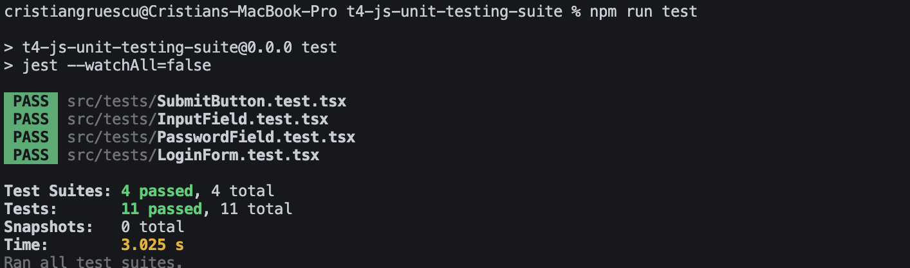

# Documentație

## 1. Strategii de testare

Pentru testarea aplicației am folosit următoarele strategii și tool-uri:

- **Jest** — cadrul principal pentru testare, folosit pentru a crea și rula teste unitare și mock-uri.
- **React Testing Library** — pentru testarea componentelor React, simulând comportamentul utilizatorului în mod realist (ex: introducerea textului, click pe butoane).
- **Mocking** — am creat mock-uri pentru componente (ex: LoginForm) pentru a testa izolarea și funcționalitatea lor fără dependențe externe.
- **Testare unitară** — verifică că fiecare componentă React se afișează corect și răspunde la interacțiuni.
- **Testare comportamentală** — simularea acțiunilor reale ale utilizatorului pentru validarea comportamentului.

### Exemplu de test pentru componenta `SubmitButton`

```tsx
import { render, screen } from "@testing-library/react";
import userEvent from "@testing-library/user-event";
import SubmitButton from "./SubmitButton";

describe("SubmitButton", () => {
  test("renders with default label", () => {
    render(<SubmitButton />);
    expect(screen.getByRole("button", { name: /submit/i })).toBeInTheDocument();
  });

  test("renders with custom label", () => {
    render(<SubmitButton>Login</SubmitButton>);
    expect(screen.getByRole("button", { name: /login/i })).toBeInTheDocument();
  });

  test("calls onClick when clicked", async () => {
    const user = userEvent.setup();
    const handleClick = jest.fn();

    render(<SubmitButton onClick={handleClick}>Click me</SubmitButton>);
    const button = screen.getByRole("button", { name: /click me/i });

    await user.click(button);
    expect(handleClick).toHaveBeenCalledTimes(1);
  });

  test('is disabled when "disabled" prop is true', () => {
    render(<SubmitButton disabled>Submit</SubmitButton>);
    const button = screen.getByRole("button", { name: /submit/i });

    expect(button).toBeDisabled();
  });
});
```

# Diagrama fluxului testelor pentru PasswordField

graph TD
A[Render PasswordField] --> B[Verifica daca input cu testid password-input exista]
B --> C{Input găsit?}
C -- Da --> D[Testează dacă label-ul este afișat corect]
C -- Nu --> E[Test eșuat: Inputul nu există]

A --> F[Test pentru onChange]
F --> G[Simulează tastare în input]
G --> H[Verifică dacă onChange a fost apelat]

A --> I[Test pentru toggle vizibilitate]
I --> J[Verifică tipul input]
J --> K[Simulează click pe butonul toggle]
K --> L[Verifică dacă tipul input s-a schimbat în text]
L --> M[Simulează click din nou pe toggle]
M --> N[Verifică dacă tipul input s-a schimbat înapoi la password]

[Link Diagrama](https://mermaid.live/edit#pako:eNqVUs2O2jAQfpWRz4CygQTIoVUXypb9U9WueijhMCQmWJvYkWO3LIgTT7Ev0Zcoh32sTpxCWe2pFyv2fH8zmS1LVMpZxGKZaSxX8DCOJcCH2RcuU67hM1bVT6XTieB5Ood2-x1czr5xLZYiQUiRDiFLayCxYHhlRArlX0q7KfC1qAzOa9VLxx9tp66QHfaVMO93dWVEFRijq49nDyTEcXPY1wZ05rjgedvmUL8DLsXLM5Kj0jwx8xP93jr6R0cH_vJs0UTgvIgqbZPksCeGa9GhJw265NJoC0qOVigz7kQnDnA1-yoKmzdxDFIrmsPvX7Jp2wGvHPDTcSyn2Ec1QFgqMsGS52he2U9f2RuVZTmHH2IjFiIXBk2TZOqw12cGRpTU078I1w5xc541yUXySMqwsEZJQjfqDn7j4LdvEp_JQtVGqJKVKBY067phw9eN2a1j3701S4UEqWxtemZ25-D3_2WGpRL020-7NGctlmmRsojmxFus4LrA-sq2tUXMzIoXPGYRfaaoH2Pa5x1xSpTflSqONK1stmLREvOKbrZMacJjgbT5xelVu8UfKSsNi7pB34mwaMvWdPW8ThBc-IOg5w_C3tDvtdgTi_yu3wm9oR8Mht3uIPT7wa7FNs7X64Rhf-B7YRj0PN_zvIvdH92xLJg)

## Configurația Hardware

Pentru dezvoltare și rularea testelor, am utilizat un MacBook Pro echipat cu procesor Apple M1 Pro.

Detalii hardware:

- **Model:** MacBook Pro (2021)
- **Procesor:** Apple M1 Pro, 8-core CPU (6 performanță + 2 eficiență)
- **Memorie RAM:** 16 GB unificată
- **Stocare:** SSD 512 GB
- **Sistem de operare:** macOS Sequoia

## Configurația Software

Pentru dezvoltarea și testarea proiectului am folosit următoarele versiuni și unelte software:

- **Sistem de operare:** macOS Sequoia
- **Node.js:** v20.x
- **npm:** versiunea corespunzătoare Node 20
- **React:** 19.x
- **Jest:** 29.x - folosit pentru testare unitară și mock-uri
- **@testing-library/react:** 14.x - pentru testarea componentelor React în mod declarativ
- **Material-UI (MUI):** 5.x - biblioteca UI utilizată pentru componentele vizuale
- **TypeScript:** 5.x - pentru tipare statice și siguranța codului
- **Editor:** Visual Studio Code 1.79.x

## Utilizarea unei mașini virtuale

Pentru acest proiect nu am folosit o mașină virtuală (VM). Dezvoltarea și testarea s-au realizat direct pe mașina fizică, un MacBook Pro cu procesor Apple M1 Pro.

## Capturi de ecran cu rularea testelor și rezultatele oferite de tool-uri

Mai jos este un screenshot care prezintă rularea testelor unitare folosind Jest și React Testing Library, împreună cu rezultatele afișate de tool-uri.



## Interpretarea testelor și scorul de acoperire (Coverage Score)

În cadrul proiectului, testele automate au fost dezvoltate pentru a asigura calitatea componentelor esențiale ale interfeței de autentificare, incluzând `InputField`, `PasswordField`, `SubmitButton` și `LoginForm`. Testele au fost implementate folosind Jest și React Testing Library, având ca scop verificarea funcționalității componentelor în diverse scenarii de utilizare.

### Rezumatul testelor efectuate

- **InputField**
  - Redare corectă cu etichetă.
  - Afișare a mesajelor de eroare și helper text.
  - Apelul funcției `onChange` la tastare.
- **PasswordField**

  - Afișarea corectă a câmpului de parolă cu test ID specific.
  - Verificarea apelului funcției `onChange` la introducerea datelor.
  - Funcționalitatea de toggle a vizibilității parolei.

- **SubmitButton**

  - Redare cu eticheta implicită și personalizată.
  - Apelul funcției `onClick` la apăsarea butonului.
  - Comportamentul butonului în stare dezactivată (`disabled`).

- **LoginForm**
  - Verificarea structurii formularului cu toate câmpurile esențiale (email, parolă, buton submit).

### Interpretarea rezultatelor

Toate testele au fost executate cu succes, confirmând că componentele testate funcționează conform așteptărilor și răspund corect la interacțiunile utilizatorului. Acoperirea testelor asigură validarea logicii critice și a interfeței utilizator, oferind încredere în stabilitatea și calitatea codului.

## Referințe bibliografice

1. **Jest - JavaScript Testing Framework**  
   Facebook. (2023). _Jest: Delightful JavaScript Testing_. Disponibil la: [https://jestjs.io/](https://jestjs.io/)  
   Accesat în 2025.

2. **React Testing Library**  
   Kent C. Dodds. (2023). _React Testing Library Documentation_. Disponibil la: [https://testing-library.com/docs/react-testing-library/intro](https://testing-library.com/docs/react-testing-library/intro)  
   Accesat în 2025.

3. **Material-UI (MUI) React Components**  
   Material-UI Team. (2023). _Material UI - React components_. Disponibil la: [https://mui.com/](https://mui.com/)  
   Accesat în 2025.

4. **React Official Documentation**  
   Facebook. (2023). _React – A JavaScript library for building user interfaces_. Disponibil la: [https://reactjs.org/](https://reactjs.org/)  
   Accesat în 2025.

5. **Node.js**  
   OpenJS Foundation. (2023). _Node.js JavaScript runtime_. Disponibil la: [https://nodejs.org/](https://nodejs.org/)  
   Accesat în 2025.

6. **OpenAI ChatGPT**  
   OpenAI. (2023). _ChatGPT Language Model_. Disponibil la: [https://chat.openai.com/](https://chat.openai.com/)  
   Accesat în 2025.

---

_Toate resursele au fost consultate pentru implementarea și testarea componentelor din acest proiect._
